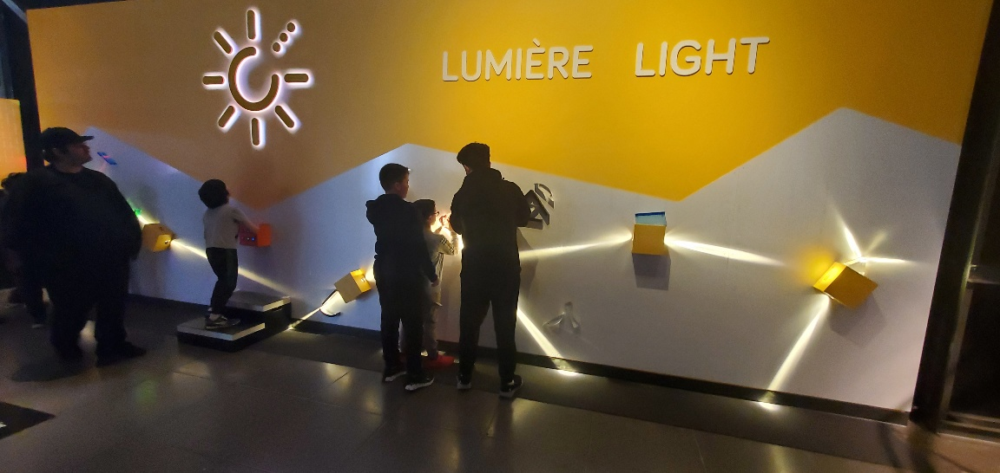
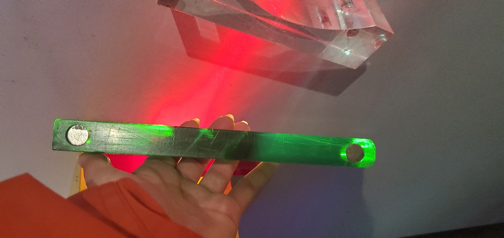
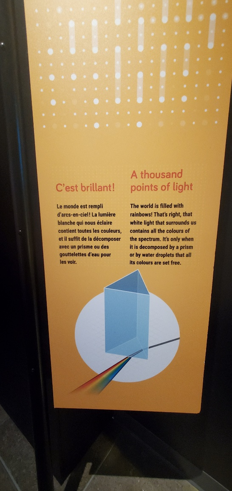
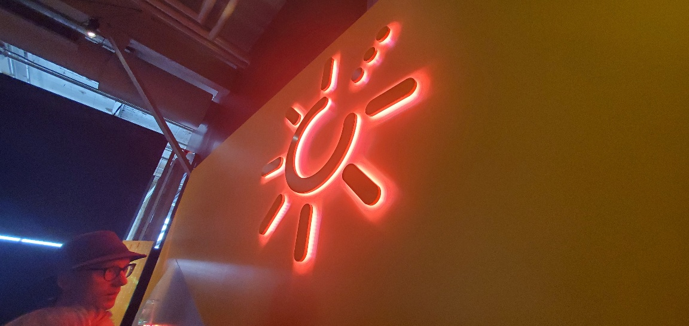
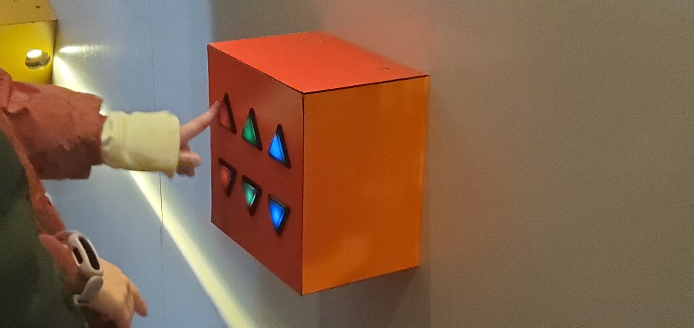
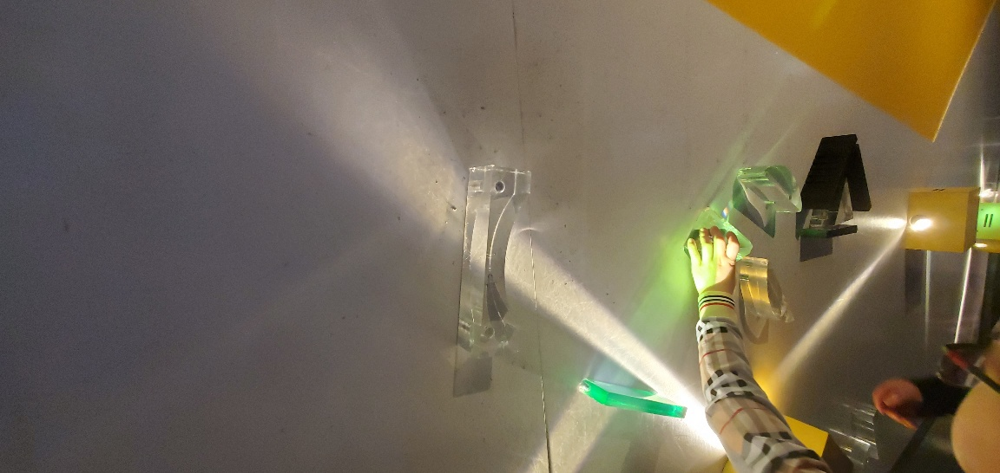
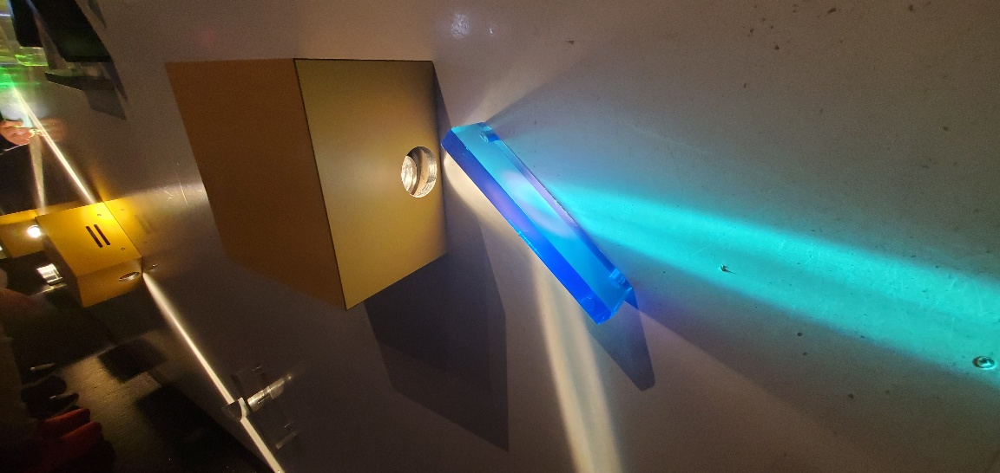

# **Exposition au Centre des Sciences**

## Introduction à l'exposition

L'exposition se situait au Centre des Sciences et comportait plusieurs dispositifs. Le titre de l'exposition était La science en grand. Elle avait des dispositifs sur des sujets de science tels que le mouvement méchanique de l'air, l'eau, la géométrie, etc. Le dispositif duquel je traîterai était situé sur le mur au fond de la pièce et permettait d'examiner la lumière. 

Photo du dispositif

## Description de la salle

La pièce était ouverte et assez saturée en dispositifs, c'est à dire que la pièce était utilisée à son plein potentiel. Il y avait très peu de murs qui séparaient les objets et on pouvait voir la pièce pratiquement entière dès l'entrée.

## Description de la présentation

La présentation sur laquelle je me suis concentrée était dans le fond de la grande pièce. Le dispositif était en effet sur le mur au compplet. Ce mur était peint jaune et dessus nous pouvions remarquer des boîtes qui émettaient de la lumière. Au centre de ce mur, il y avait une forme d'ampoule surélevée qui projetait derrière elle une lumière de couleur. La couleur de cette lumière était programmée grâce à une boîte qui se situait sous la forme d'ampoule. Sur cette boîte, il y avait six boutons qui avaient une forme de flèche. Ces flèches étaient séparrées en trois couleurs, soit le rouge, le bleu et le vert. Il y avait donc une flèche pour augmenter la quantité de chaque couleur et une flèche pour diminuer la quantité de chaque couleur. Ensuite, partout sur le mur était placé des morceaux de plastiques transparents sous formes de différentes lentilles. Celles-ci étaient aimentées sur le mur et pouvaient être déplacées par les usagers. Les formes de lentilles permettaient de dévier la lumière de plusieurs façons. Il y en avait aussi de différentes couleurs pour changer la couleur du rayon de lumière.

Photo des aimants sur les lentilles

Photo du cartel

Photo de la forme d'ampoule

Photo de la boite qui programme la lumière

Photo des lentilles

Photo des lentilles de couleur

## Informations pertinantes

Le dispositif fait parti d'une exposition permanante qui restera au musée pour une durée totale d'environ 10 ans. C'est en effet une exposition interactive qui permet d'éduquer d'une manière moins habituelle. L'exposition est située au Centre des Sciences et se nomme La science en grand. Il s'y trouve également un cartel contenant des imformations sur les dispositifs.

Photo du cartel du dispositif sur la lumière.

## Composantes et techniques

 Les composantes techniques sont:
 - Les projecteurs de lumière
 - La forme de lumière
 - La boîte de réglage de couleurs
 - Les lentilles aimantées

## ***Critique***

## Ce qui m'as plu le plus

J'ai beaucoup aimé le degré d'interaction que l'usager a sur le dispositif, c'est à dire que le visiteur peut contrôller pratiquement tout afin d'apprendre de lui même comment la lumière se comporte. C'est également bien adapté pour les jeunes puisque c'est intuitif et très visuel.

## Ce que j'aurais fait différement

La remarque que j'aurais à faire serait que la lumière qui était émise en rayon était assez diffuse, donc elle ne se fesait pas bien dévier par les lentilles. Ceci réduisait beaucoup selon-moi la qualité du dispositif et rendait l'expérience moins agréable puisqu'après avoir traversé seulement une lentilles, la lumière était pratiquement complètement diffuse et nous ne pouvions voir l'effet que le dispositif était sensé démontrer.

## ***Références***

https://www.centredessciencesdemontreal.com/exposition-permanente/explore
