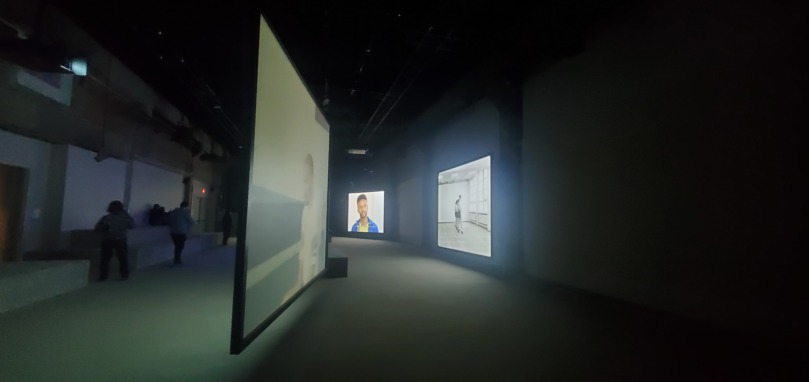

# **Exposition Jeremy Shaw: Phase Shifting Index**

## Introduction à l'exposition

L'exposition de Jeremy Shaw présentée à la Fonderie Darling du 12 Décembre 2023 au 25 Févrirer 2024, à Montréal comprend deux salles avec du contenue de son oeuvre. L'exposition est immersive et détient du contenu de photographie et vidéo.

Photo de la pièce d'entrée

## Description de la salle

Phase Shifting Index présente 7 vidéos diffusés simultanément sur 7 écrans projecteurs dispersés symetriquement dans la salle. On retrouve des estrades dans le fond de la salle, recouverts de tapis, ainsi que des banc placés devant quelques écrans, également recouvert de tapis. Ce tapis gris recouvre de plus le sol de l'exibition. Des hauts parleurs sont installés près de chaque écrans diffusant le contenu audio respectif de chaque présentation vidéo. Il y a également des hauts parleurs projetant des sons de base dans le fond de la pièce. Des installation de lumières sont sur le plafond.

Photo des écrans projecteurs

Photo des estrades

Photo des haut-parleurs

Photo des installations de lumière

Photo des projecteurs

## Description de la présentation

Les 7 vidéos projetés exposent des groupes distincts qui semblent s'exprimer avec des mouvements corporels et de danse. Les hauts parleurs présentent les sons respectifs de chaque vidéo, soit leurs paroles et de la musique. À un moment, les vidéos et le son se syncronise et les danseurs executent la même chorégraphie jusqu'à ce que le vidéo devient un data moshing qui créé un effet de «glitch» et donne un effet psychadélique et la musique donne un sentiment de confusion. À la fin du vidéo les lumière d'ambiance deviennent colorées et le vidéo tourne vers une présentation d'une animation qui semble organique et colorée. La musique devient plus douce et zen.

## Informations pertinantes

L'exposition est sous forme temporaire et itinérante ainsi que de type immersive. Elle se situe à l'intérieur. Cette dernière a été inaugurée en 2020 et se situe présentement, en 2024, à la Fonderie Darling,  Montréal. Les seules cartels présents dans l'exposition se situent dans la première pièce comportant des images.

## Composantes et techniques

 Les composantes techniques sont:
 - Les projecteurs
 - Les écrans de projecteurs
 - Les haut-parleurs
 - Les bases de son
 - Les estrades
 - Les tapis

Ces derniers n'ont pas besoin d'être transportés outremer, puisque les seules éléments qui sont consistants selon l'endroit d'expoisition serait les éléments de projection et de son. Les tapis et estrades doivent être fait sur mesure selon les dimensions de la pièce. Par conséquent, les éléments nécéssaires à la mise en exposition sont ces derniers ainsi qu'un système d'organisation pour les fils électroniques.

## ***Critique***

## Ce qui m'as plu le plus

L'élément qui m'as captivé les plus dans cette exposition est quand tous les écrans se sont syncronisés et que la musique fesait un tout, car au début je ressentait un effet chaotique par le fait que tous les vidéos étaient différents et que le son changeait tout dépendant de l'écran qu'on visionnait. Quand tout s'est uni, c'est là que nous avons pu comprendre le sens de cet exposition plus en profondeur.

## Ce que j'aurais fait différement

Le seul élément qui m'as déplus serait l'organisation des écrans, c'est à dire que nous ne pouvions voir tous les écrans simultanément. J'aurais aimé pouvoir voir toutes les projections en même temps à partir de l'estrade pour mieux comprendre le sujet de l'exposition.

## ***Références***

https://macm.org/en/exhibitions/jeremy-shaw/
