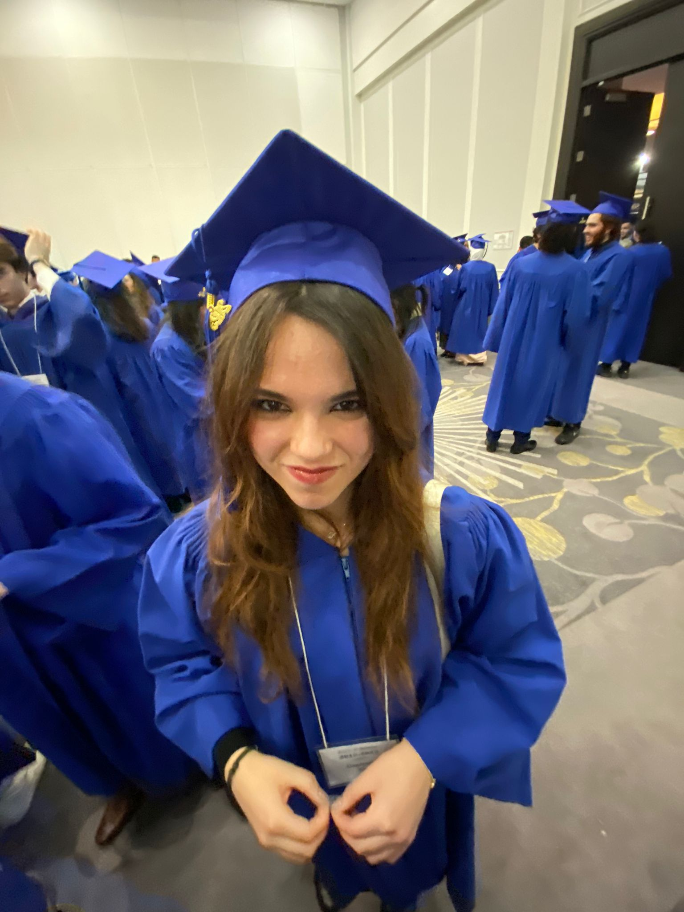

# Kim Cayouette

Photo de moi à ma graduation du secondaire, École d'Éducation Internationale de Laval, 10 Janvier 2023

## **Intérêts dans le multimédia** 
Je suis quelqu'un qui a toujours aimé créer, j'aime bien le dessin et les films et l'animation m'interesse. Je ne suis toujours pas certaine si je me dirige dans la bonne carrière, mais j'essaie de nouvelles choses et je développe de nouvaux talents en suivant cette technique.

## **Autres intérête**
Je m'intéresse beaucoup à l'espace. Dans mes temps libres, qui sont de plus en plus rares, j'aime passer du temps à apprendre des informations sur des planètes ou des étoiles. Je suis aussi passionnée des films Star Wars, à l'exeption des trois derniers films. Je fais du tir à l'arc quelques fois par semaine depuis 7 ans et, finalement, je suis une grande amatrice de LEGO.
